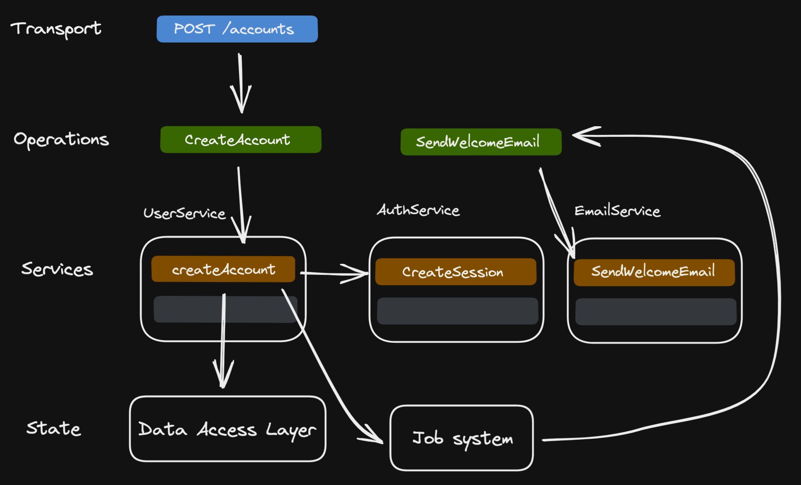
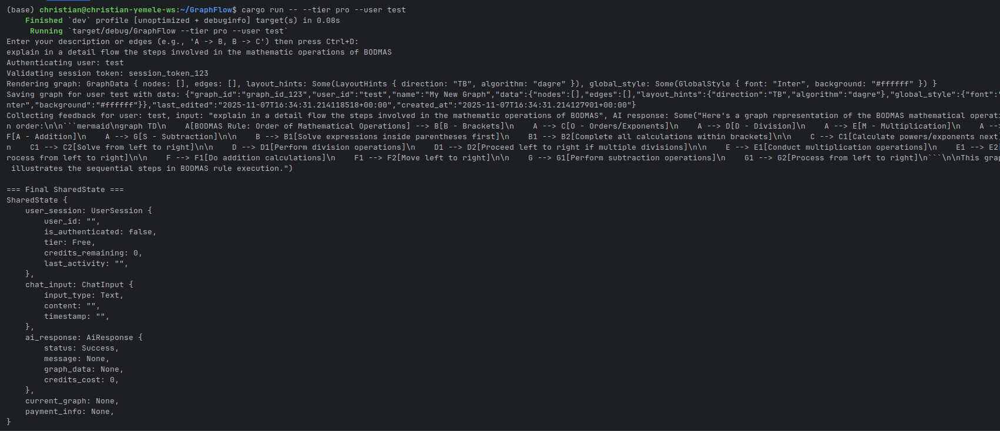
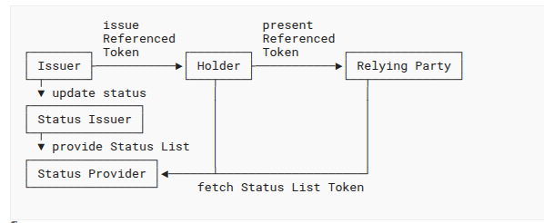

GraphFlow is a Rust CLI demo built with It turns short natural-language descriptions or edge lists into graph structures using LLMs, with tiered routing:

- Free tier uses Anthropic Claude (Haiku by default)
- Pro tier uses OpenAI (GPT-4o by default)

## Getting Started

1. Install Rust: https://rustup.rs/
2. Optional: create a `.env` in the repo root to store API keys
   - `OPENAI_API_KEY=...` (for Pro tier)
   - `ANTHROPIC_API_KEY=...` (for Free tier)
3. Run the CLI:
   - Interactive stdin: `cargo run`
   - With flags: `cargo run -- --tier pro --user alice --credits 250`

## Project Structure

- `src/main.rs` - Entry point
- `src/flow.rs` - Flow definition
- `src/nodes.rs` - Node implementations
- `src/utils.rs` - Utility functions (LLM calls, etc.)
- `Cargo.toml` - Dependencies (only pocketflow)

- We have included rules files for various AI coding assistants to help you build LLM projects:
  - [.cursorrules](.cursorrules) for Cursor AI
  - [.clinerules](.clinerules) for Cline
  - [.windsurfrules](.windsurfrules) for Windsurf
  - [.goosehints](.goosehints) for Goose
  - Configuration in [.github](.github) for GitHub Copilot
  - [CLAUDE.md](CLAUDE.md) for Claude Code
  - [GEMINI.md](GEMINI.md) for Gemini
  
- Want to learn how to build LLM projects with Agentic Coding?

  - Check out the [Agentic Coding Guidance](https://the-pocket.github.io/PocketFlow/guide.html)
    
  - Check out the [YouTube Tutorial](https://www.youtube.com/@ZacharyLLM?sub_confirmation=1)

## CLI Usage

- Arguments
  - `--user <id>` Default: `GF_USER` env or `test`
  - `--tier <free|pro>` Default: `free`
  - `--credits <u32>` Default: `100`
  - `--input-file <path>` Read input from a file instead of stdin

- Input
  - Provide a brief description or an edge list like `A -> B, B -> C`
  - If no `--input-file` is provided, the program reads from stdin until EOF (Ctrl+D)

- Environment variables
  - General
    - `GF_USER` User id default for `--user`
  - Free tier (Anthropic)
    - `ANTHROPIC_API_KEY` Required for `--tier free`
    - `ANTHROPIC_MODEL` Optional (default: `claude-3-5-haiku-latest`)
  - Pro tier (OpenAI)
    - `OPENAI_API_KEY` Required for `--tier pro`
    - `OPENAI_MODEL_PRO` Optional (default: `gpt-4o`)

- Examples
  - Stdin, Free tier (default):
    ```bash
    export ANTHROPIC_API_KEY=sk-ant-...
    echo "A -> B, B -> C" | cargo run
    ```
  - Pro tier with OpenAI:
    ```bash
    export OPENAI_API_KEY=sk-openai-...
    echo "Team -> Project -> Tasks" | cargo run -- --tier pro --user test
    ```
  - From file:
    ```bash
    printf "Marketing -> Leads, Leads -> Sales" > input.txt
    cargo run -- --input-file input.txt --credits 500
    ```

- .env support
  - The app loads `.env` automatically when present (via `dotenvy`). Example:
    ```env
    GF_USER=alice
    ANTHROPIC_API_KEY=sk-ant-...
    OPENAI_API_KEY=sk-openai-...
    ```

## Output

- The program prints the final SharedState, including any generated graph data and credits usage. Example ending lines:
  ```
  === Final SharedState ===
  SharedState { ... }
  ```

## Troubleshooting

- Missing API key
  - For Free tier, set `ANTHROPIC_API_KEY`
  - For Pro tier, set `OPENAI_API_KEY`
- No output or empty response
  - Ensure the model env vars are correct or rely on defaults (`claude-3-5-haiku-latest`, `gpt-4o`)
- Stdin hangs
  - Provide input, then press Ctrl+D (EOF), or use `--input-file`

## Screenshots

- CLI run (stdin example):
  
  

- Example graph output preview:
  
  

Place your own screenshots at the above paths or adjust filenames as needed.

## Excalidraw Rendering (PNG/SVG)

You can export an Excalidraw scene JSON from the CLI and render exact Excalidraw-style images (no LLM):

- Export scene JSON during run:
  ```bash
  echo "A -> B, B -> C" | cargo run -- --export-excalidraw out.excalidraw.json
  ```

- Render to PNG:
  ```bash
  node tools/render-excalidraw/render.js out.excalidraw.json docs/screens/graph.png
  ```

- Render to SVG:
  ```bash
  node tools/render-excalidraw/render.js out.excalidraw.json docs/screens/graph.svg
  ```

Notes:
- Renderer uses a headless browser with Excalidraw’s UMD build for exact styling.
- First run downloads Chromium via Puppeteer (internet required).
- Recommended to store outputs under `docs/screens/` for docs.

## REST Server & API Docs

You can run GraphFlow as an HTTP server and consume it from your frontend. The server exposes OpenAPI documentation and an interactive Swagger UI.

- Start the server (example):
  ```bash
  cargo run -- --serve --port 8080 --allow-images --assets-dir assets/icons
  ```

- Swagger UI:
  - UI: http://localhost:8080/docs
  - OpenAPI JSON: http://localhost:8080/api-doc/openapi.json

- Endpoints:
  - POST /graph/generate
    - Input JSON:
      - `content`: string (user description)
      - `tier`: "free" | "pro" (optional)
      - `allow_images`: boolean (optional, default false)
      - `assets_dir`: string (optional, default `assets/icons`)
    - Response JSON:
      - `graph_data`: structured graph
      - `scene`: Excalidraw scene JSON
      - `artifacts`: suggested names for PNG/SVG

  - POST /graph/render
    - Input JSON:
      - `scene`: Excalidraw scene JSON (optional if `graph_data` provided)
      - `graph_data`: GraphData (optional if `scene` provided)
      - `filename_hint`: optional string
      - `formats`: ["png","svg"] (default both)
    - Response JSON:
      - `suggested`: base filename
      - `png`: path if rendered
      - `svg`: path if rendered

- Curl examples:
  - Generate:
    ```bash
    curl -s -X POST http://localhost:8080/graph/generate \
      -H 'content-type: application/json' \
      -d '{
        "content": "Marketing -> Leads -> Sales",
        "tier": "free",
        "allow_images": true,
        "assets_dir": "assets/icons"
      }' | jq .
    ```
  - Render (from a scene JSON):
    ```bash
    curl -s -X POST http://localhost:8080/graph/render \
      -H 'content-type: application/json' \
      -d '{
        "scene": { /* paste scene JSON here */ },
        "filename_hint": "marketing-leads-sales",
        "formats": ["png","svg"]
      }' | jq .
    ```

## Sample JSON Output

Below is a representative JSON for the final `SharedState` when processing an input like `A -> B, B -> C`. Actual values will vary.

```json
{
  "user_session": {
    "user_id": "alice",
    "is_authenticated": true,
    "tier": "Pro",
    "credits_remaining": 245,
    "last_activity": "2025-11-07T16:25:12Z"
  },
  "chat_input": {
    "input_type": "Text",
    "content": "A -> B, B -> C",
    "timestamp": "2025-11-07T16:25:10Z"
  },
  "ai_response": {
    "status": "Success",
    "message": "Parsed 3 nodes and 2 edges",
    "graph_data": {
      "nodes": [
        {"id": "A", "label": "A", "x": 0.0, "y": 0.0, "style": {"shape": "circle", "color": "#4F46E5"}},
        {"id": "B", "label": "B", "x": 140.0, "y": 0.0, "style": {"shape": "circle", "color": "#10B981"}},
        {"id": "C", "label": "C", "x": 280.0, "y": 0.0, "style": {"shape": "circle", "color": "#F59E0B"}}
      ],
      "edges": [
        {"id": "A_B", "source": "A", "target": "B", "label": "A→B", "style": {"line": "solid", "arrow": "triangle"}},
        {"id": "B_C", "source": "B", "target": "C", "label": "B→C", "style": {"line": "solid", "arrow": "triangle"}}
      ],
      "layout_hints": {"direction": "LR", "algorithm": "dagre"},
      "global_style": {"font": "Inter", "background": "#0B1021"}
    },
    "credits_cost": 5
  },
  "current_graph": null,
  "payment_info": null
}
```
