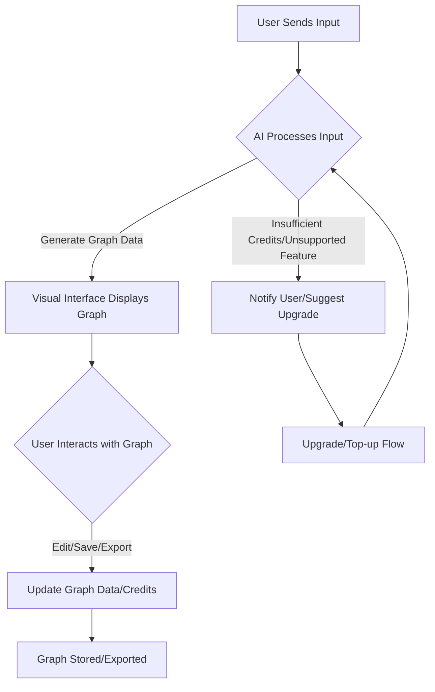

# Design Doc: ExcalidGPT

## Requirements

ExcalidGPT is an AI-powered chat web application designed to transform user descriptions into visual flow diagrams and graphs. Users can articulate processes, ideas, or systems in natural language, and the application will automatically generate an interactive, visually appealing graph. The aesthetic of the generated graphs will mimic Excalidraw's clean, hand-drawn style, featuring rounded corners, smooth lines, and a lightweight sketch feel to promote creativity and a human touch.

The core problem ExcalidGPT solves is the translation of abstract textual descriptions into concrete, editable visual representations, making complex ideas easier to understand, organize, and share.

## Flow Design

ExcalidGPT operates as a chat-based application where users interact with an AI assistant. The primary flow involves the user providing input, the AI processing it to generate a graph structure, and the visual editor displaying the result for user interaction and saving.

### Applicable Design Pattern:

1.  **Agent:** The AI assistant acts as an agent, interpreting user input and deciding on the appropriate graph generation action based on user tier and input type.
    *   *Context*: User input (text, image, link, video), user's credit balance, user tier (Free/Pro).
    *   *Action*: Generate graph from text, generate graph from rich media, deny generation (insufficient credits/unsupported feature for tier), update credits, save graph, export graph.
2.  **Workflow:** The overall interaction from input to graph display, editing, and saving forms a clear workflow.

### Flow High-Level Design:

1.  **User Input Node:** Captures user's description (text, image, link, video) via the chat interface.
2.  **AI Processing Node:** Analyzes input, determines user tier, checks credits, and generates structured graph data.
3.  **Graph Rendering Node:** Displays the generated graph in an interactive visual editor.
4.  **User Interaction Node:** Allows users to edit, save, export, or share the graph.
5.  **Credit Management Node:** Updates user credits based on generation and other actions.



## Utility Functions

The system will rely on several utility functions to handle various aspects of its operation, particularly for AI processing, data storage, and payment.

1.  **Call LLM/AI Model** (`utils/ai_processor.rs`)
    *   *Input*: User input (text, image data, link, video data), context (e.g., previous chat history, user preferences).
    *   *Output*: Structured graph data (JSON/YAML containing nodes, edges, relationships, layout hints, styles).
    *   *Necessity*: Core function for transforming user descriptions into graph structures. This utility will integrate with various AI models for multimodal input processing.

2.  **Image/Video/Link Parser** (`utils/media_parser.rs`)
    *   *Input*: Image file, video file, URL.
    *   *Output*: Extracted text, key concepts, or summarized content from the media.
    *   *Necessity*: Used by the AI Processing Node for Pro users to convert rich media into a format suitable for graph generation.

3.  **Database Operations** (`utils/db_manager.rs`)
    *   *Input*: User data (account info, credits), graph data (nodes, edges, styles), session tokens.
    *   *Output*: Stored/retrieved data, success/failure status.
    *   *Necessity*: Manages persistence for user accounts, generated graphs, and credit balances.

4.  **Payment Gateway Integration** (`utils/payment_gateway.rs`)
    *   *Input*: Payment details (credit card info), amount, user ID.
    *   *Output*: Transaction status (success/failure), transaction ID.
    *   *Necessity*: Handles secure processing of payments for Pro subscriptions and credit top-ups.

5.  **Authentication & Session Management** (`utils/auth_manager.rs`)
    *   *Input*: User credentials (username/password), session tokens.
    *   *Output*: Authenticated user session, user ID, access tokens.
    *   *Necessity*: Secures user accounts and manages active sessions.

## Data Design

The shared store will be a central repository for all data exchanged between nodes, ensuring consistency and minimizing redundancy.

### Shared Store

The shared store structure is organized as follows:

```rust
// Example of a shared state struct in Rust
// This would typically be a struct with fields that can be accessed by different nodes.
// For a real application, you'd use a more robust serialization format like Serde.
struct SharedState {
    user_session: UserSession,
    chat_input: ChatInput,
    ai_response: AiResponse,
    current_graph: Option<Graph>, // Option because it might not always be present
    payment_info: Option<PaymentInfo>, // Option because it might not always be present
}

struct UserSession {
    user_id: String,
    is_authenticated: bool,
    tier: UserTier, // Enum: Free, Pro
    credits_remaining: u32,
    last_activity: String, // Timestamp
}

enum UserTier {
    Free,
    Pro,
}

struct ChatInput {
    input_type: InputType, // Enum: Text, Image, Link, Video
    content: String, // User description or media URL/base64
    timestamp: String,
}

enum InputType {
    Text,
    Image,
    Link,
    Video,
}

struct AiResponse {
    status: AiStatus, // Enum: Success, Failure
    message: Option<String>, // Error message if any
    graph_data: Option<GraphData>, // Structured graph data for rendering
    credits_cost: u32,
}

enum AiStatus {
    Success,
    Failure,
}

struct GraphData {
    nodes: Vec<NodeData>,
    edges: Vec<EdgeData>,
    layout_hints: Option<LayoutHints>,
    global_style: Option<Glob alStyle>,
}

struct NodeData {
    id: String,
    label: String,
    x: f32,
    y: f32,
    style: NodeStyle,
}

struct EdgeData {
    id: String,
    source: String,
    target: String,
    label: String,
    style: EdgeStyle,
}

struct LayoutHints {
    direction: String, // e.g., "TB", "LR"
    algorithm: String, // e.g., "dagre"
}

struct GlobalStyle {
    font: String,
    background: String,
}

struct NodeStyle {
    shape: String, // e.g., "rectangle"
    color: String, // e.g., "blue"
}

struct EdgeStyle {
    line: String, // e.g., "smooth"
    arrow: String, // e.g., "end"
}

struct Graph {
    graph_id: String,
    user_id: String,
    name: String,
    data: GraphData,
    last_edited: String,
    created_at: String,
}

struct PaymentInfo {
    transaction_id: String,
    amount: f32,
    currency: String,
    status: PaymentStatus, // Enum: Completed, Pending, Failed
    timestamp: String,
}

enum PaymentStatus {
    Completed,
    Pending,
    Failed,
}
```

## Node Design

### Shared Store

The shared store structure is organized as follows:

```rust
// Example of a shared state struct in Rust
// This would typically be a struct with fields that can be accessed by different nodes.
// For a real application, you'd use a more robust serialization format like Serde.
struct SharedState {
    user_session: UserSession,
    chat_input: ChatInput,
    ai_response: AiResponse,
    current_graph: Option<Graph>, // Option because it might not always be present
    payment_info: Option<PaymentInfo>, // Option because it might not always be present
}

struct UserSession {
    user_id: String,
    is_authenticated: bool,
    tier: UserTier, // Enum: Free, Pro
    credits_remaining: u32,
    last_activity: String, // Timestamp
}

enum UserTier {
    Free,
    Pro,
}

struct ChatInput {
    input_type: InputType, // Enum: Text, Image, Link, Video
    content: String, // User description or media URL/base64
    timestamp: String,
}

enum InputType {
    Text,
    Image,
    Link,
    Video,
}

struct AiResponse {
    status: AiStatus, // Enum: Success, Failure
    message: Option<String>, // Error message if any
    graph_data: Option<GraphData>, // Structured graph data for rendering
    credits_cost: u32,
}

enum AiStatus {
    Success,
    Failure,
}

struct GraphData {
    nodes: Vec<NodeData>,
    edges: Vec<EdgeData>,
    layout_hints: Option<LayoutHints>,
    global_style: Option<GlobalStyle>,
}

struct NodeData {
    id: String,
    label: String,
    x: f32,
    y: f32,
    style: NodeStyle,
}

struct EdgeData {
    id: String,
    source: String,
    target: String,
    label: String,
    style: EdgeStyle,
}

struct LayoutHints {
    direction: String, // e.g., "TB", "LR"
    algorithm: String, // e.g., "dagre"
}

struct GlobalStyle {
    font: String,
    background: String,
}

struct NodeStyle {
    shape: String, // e.g., "rectangle"
    color: String, // e.g., "blue"
}

struct EdgeStyle {
    line: String, // e.g., "smooth"
    arrow: String, // e.g., "end"
}

struct Graph {
    graph_id: String,
    user_id: String,
    name: String,
    data: GraphData,
    last_edited: String,
    created_at: String,
}

struct PaymentInfo {
    transaction_id: String,
    amount: f32,
    currency: String,
    status: PaymentStatus, // Enum: Completed, Pending, Failed
    timestamp: String,
}

enum PaymentStatus {
    Completed,
    Pending,
    Failed,
}
```

### Node Steps

1.  **AuthenticationNode**
    *   *Purpose*: Handles user login, registration, and session validation.
    *   *Type*: Regular
    *   *Steps*:
        *   *prep*: Read user credentials or session token from `shared`.
        *   *exec*: Call `auth_manager.authenticate()` or `auth_manager.validate_session()`.
        *   *post*: Write `user_session` (user_id, tier, credits) to `shared`. Returns "authenticated" or "unauthenticated".

2.  **ChatInputNode**
    *   *Purpose*: Captures and stores user input from the chat interface.
    *   *Type*: Regular
    *   *Steps*:
        *   *prep*: None (input comes directly from user interaction).
        *   *exec*: Receives user's chat message (text, or reference to uploaded media/link).
        *   *post*: Write `chat_input` to `shared`. Returns "input_received".

3.  **AIProcessingNode**
    *   *Purpose*: Analyzes user input, checks credits/tier, and generates structured graph data.
    *   *Type*: Regular (can be Async for long-running AI calls)
    *   *Steps*:
        *   *prep*: Read `chat_input` and `user_session` from `shared`.
        *   *exec*:
            *   Check `user_session.tier` and `chat_input.type` for feature access.
            *   Check `user_session.credits_remaining` against `credits_cost` for generation.
            *   If allowed, call `ai_processor.call_llm()` (and `media_parser.parse()` if needed) to generate graph data.
            *   Handle potential errors (e.g., AI model failure, unsupported input).
        *   *post*: Write `ai_response` (graph_data, status, credits_cost) to `shared`. Returns "graph_generated", "insufficient_credits", or "unsupported_feature".

4.  **GraphRenderingNode**
    *   *Purpose*: Displays the generated graph in the visual editor and enables real-time interaction.
    *   *Type*: Regular
    *   *Steps*:
        *   *prep*: Read `ai_response.graph_data` from `shared`.
        *   *exec*: (Frontend responsibility) Renders the graph using a library like Excalidraw or a custom renderer. Handles interactive elements (move nodes, edit labels).
        *   *post*: None (frontend-driven interaction). Returns "graph_displayed".

5.  **GraphPersistenceNode**
    *   *Purpose*: Stores and retrieves user-generated graphs from the database.
    *   *Type*: Regular
    *   *Steps*:
        *   *prep*: Read `user_session.user_id` and `current_graph.data` (for saving) or `graph_id` (for retrieving) from `shared`.
        *   *exec*: Call `db_manager.save_graph()` or `db_manager.retrieve_graph()`.
        *   *post*: If saving, update `current_graph` in `shared`. If retrieving, populate `current_graph` in `shared`. Returns "graph_saved" or "graph_retrieved".

6.  **CreditUpdateNode**
    *   *Purpose*: Adjusts user credit balance after graph generation or top-up.
    *   *Type*: Regular
    *   *Steps*:
        *   *prep*: Read `user_session.user_id`, `user_session.credits_remaining`, and `ai_response.credits_cost` (or `payment_info.amount` for top-up) from `shared`.
        *   *exec*: Calculate new credit balance. Call `db_manager.update_user_credits()`.
        *   *post*: Update `user_session.credits_remaining` in `shared`. Returns "credits_updated".

7.  **PaymentProcessingNode**
    *   *Purpose*: Handles secure payment for Pro subscriptions and credit top-ups.
    *   *Type*: Regular
    *   *Steps*:
        *   *prep*: Read `user_session.user_id`, `payment_info.amount`, and payment details from `shared`.
        *   *exec*: Call `payment_gateway.process_payment()`.
        *   *post*: Update `payment_info.status` and `user_session.tier` (if upgrading to Pro) in `shared`. Returns "payment_successful" or "payment_failed".

8.  **UserFeedbackNode**
    *   *Purpose*: Provides messages to the user (e.g., insufficient credits, upgrade prompt).
    *   *Type*: Regular
    *   *Steps*:
        *   *prep*: Read relevant status/messages from `shared` (e.g., `ai_response.message`).
        *   *exec*: (Frontend responsibility) Displays messages to the user.
        *   *post*: None. Returns "feedback_displayed".

## Implementation

The implementation will follow a client-server architecture. The frontend will be a single-page application (SPA) handling the UI/UX, while the backend will manage AI processing, data persistence, authentication, and payments.

### User Experience (UI/UX)

*   **Chat Interface:** A prominent chat input area at the bottom, with a scrollable history of interactions and generated graphs.
*   **Visual Editor:** A large, clean workspace occupying most of the screen, where graphs are rendered.
    *   **Excalidraw-like Aesthetics:** Hand-drawn shapes, smooth lines, rounded corners, and a light, creative sketch aesthetic.
    *   **Interactivity:** Users can drag and drop nodes, click to edit node/edge labels, and use context menus for advanced actions.
    *   **Real-time Feedback:** Smooth animations and transitions when graphs are generated or updated. Changes made by the user (e.g., moving a node) should reflect instantly.
*   **Minimalist Design:** Intuitive navigation, uncluttered workspace, and quick response times from the AI.
*   **Sidebar/Toolbar:** For actions like "Save," "Export (PNG/SVG)," "Share Link," "New Graph," "My Graphs," "Upgrade," "Top-up Credits."

### AI Capabilities

*   **Input Analysis:** The AI will parse natural language descriptions, identify key entities (nodes), actions/relationships (edges), and implicit structures (flow direction, hierarchy).
*   **Structured Graph Data Output:** The AI's output will be a JSON or YAML structure containing:
    *   `nodes`: List of node objects with `id`, `label`, `x`, `y` (layout hints), and `style` properties.
    *   `edges`: List of edge objects with `id`, `source`, `target`, `label`, and `style` properties.
    *   `layout_hints`: Optional suggestions for graph layout algorithms (e.g., "top-down," "circular") or specific node positions.
    *   `global_style`: Overall graph styling (e.g., font, background).
*   **Multimodal Input (Pro Users):**
    *   **Images:** AI analyzes diagrams, flowcharts, or sketches within images to extract graph structures.
    *   **Online Links:** AI scrapes and summarizes content from web pages to generate a flow.
    *   **Videos:** AI processes video transcripts or keyframes to identify sequences and relationships.

### Credit System

*   **Credit-based Usage:** Each graph generation consumes a certain number of credits. More complex generations (e.g., from video) might cost more.
*   **Free Users:** Receive a limited number of initial credits (e.g., 10-20) upon registration. Once depleted, they can only view/edit existing graphs or upgrade.
*   **Pro Users:** Receive a significantly larger monthly credit allocation (e.g., 500-1000) and access to credit top-up options.
*   **Credit Top-up:** Pro users can purchase additional credit packs.

### User Tiers (Free vs. Pro)

*   **Free User:**
    *   **Graph Generation:** Text-only input.
    *   **Credits:** Limited initial credits.
    *   **Storage:** Limited number of stored graphs (e.g., 5-10).
    *   **Export:** Basic image export (PNG).
*   **Pro User ($5 USD/month):**
    *   **Graph Generation:** Text, images, online links, and videos.
    *   **Credits:** Generous monthly credit allocation, ability to top-up.
    *   **Storage:** Unlimited graph storage.
    *   **Export:** Advanced export options (SVG, shareable links).
    *   **Advanced Tools:** Potentially more sophisticated AI models, custom styling options, collaboration features (future).
*   **Upgrade Flow:**
    1.  User clicks "Upgrade to Pro" or attempts a Pro-only feature.
    2.  Presented with a clear pricing page ($5 USD/month).
    3.  Secure payment system collects credit card details.
    4.  Upon successful payment, user's tier is updated to "Pro," credits are allocated, and advanced features unlocked.

### Workflow of Interaction

1.  **User Sends Input to Chat:** User types a description or uploads/links media in the chat interface.
2.  **AI Processes and Generates Graph Structure:**
    *   Backend receives input.
    *   Authenticates user session.
    *   Checks user tier and credit balance.
    *   If Pro and rich media, `media_parser` extracts content.
    *   `ai_processor` calls LLM to generate structured graph data.
    *   If successful, `credits_cost` is determined.
3.  **The Visual Interface Displays the Generated Graph:**
    *   Backend sends `ai_response.graph_data` to the frontend.
    *   Frontend renders the graph with smooth animations.
4.  **User Edits or Saves It:**
    *   User interacts with the graph (moves nodes, edits labels).
    *   Changes are reflected in real-time on the frontend.
    *   User clicks "Save" or "Export."
    *   If "Save," `GraphPersistenceNode` stores `current_graph` in the database.
5.  **Credits are Updated Accordingly:**
    *   After successful graph generation, `CreditUpdateNode` debits credits from the user's account.
    *   If a Pro user tops up credits, `CreditUpdateNode` adds credits.

### Backend Responsibilities

*   **Authentication & User Sessions:** Secure JWT-based authentication, session management, and authorization checks for features.
*   **Credit Logic:** Manages credit allocation, deduction, and top-up processes.
*   **AI Processing:** Hosts and orchestrates calls to various AI models (LLMs, vision models) for graph generation.
*   **Payment System:** Integrates with a secure third-party payment gateway (e.g., Stripe) to handle credit card transactions for Pro subscriptions and credit top-ups.
*   **Database:** Stores user accounts (hashed passwords, tier, credits), generated graphs (structured data), and payment transaction records.
*   **API Gateway:** Exposes secure RESTful APIs for frontend communication.

### Deployment

*   **Cloud Deployment:** The application will be deployed on a scalable cloud platform (e.g., AWS, Google Cloud, Azure).
*   **Minimal Latency:** Utilize CDN for static assets, optimize backend API responses, and deploy AI models in regions close to users.
*   **High Availability:** Implement load balancing, auto-scaling, and redundant database configurations to ensure continuous service.
*   **Security:** Implement robust security measures including data encryption, input validation, API security, and regular security audits.

## Optimization

*   **Prompt Engineering:** Continuously refine prompts for the AI models to improve graph generation accuracy and style adherence.
*   **Caching:** Implement caching for frequently accessed data (e.g., user profiles, common graph styles) to reduce database load and improve response times.
*   **Asynchronous Processing:** For long-running AI tasks (e.g., video analysis), use asynchronous processing to avoid blocking the user interface.

## Reliability

*   **Node Retries:** Implement retry mechanisms for external API calls (AI models, payment gateway) within the backend nodes.
*   **Logging and Monitoring:** Comprehensive logging for all system activities, especially AI processing, credit transactions, and payments. Monitoring tools to track system health and performance.
*   **Error Handling:** Graceful error handling and informative messages for users in case of failures (e.g., AI generation failure, payment processing issues).
*   **Data Backups:** Regular backups of the database to prevent data loss.
